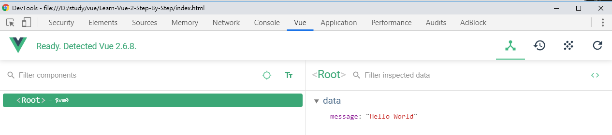
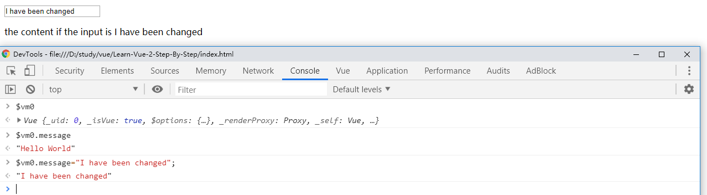

[TOC]

# [Learn Vue 2: Step By Step](https://laracasts.com/series/learn-vue-2-step-by-step)

> Vue is easily one of the most exciting additions to the front-end world in many years. With its intuitive API, and the fact that it can be applied to any type of application, it's no wonder why folks have gravitated to it as much as they have.

> If you'd like to jump on board, let me show you, step by step, exactly what you need to know. It's the best way to learn Vue!

## Episodes

### 01. [Basic Data Binding](https://laracasts.com/series/learn-vue-2-step-by-step/episodes/1)

> Let's begin with a review of basic data binding in Vue. You'll get your first glimpse into the framework's wonderful, and automatic, reactivity.

#### Note

```html
<body>
    <div id="root">
        <input type="text" id="input" v-model="message">
        <p>the content if the input is {{message}}</p>
    </div>

    <script src="https://unpkg.com/vue@2.6.8/dist/vue.js"></script>

    <script>
        // let data = {
        //     message: 'Hello World'
        // }

        // document.querySelector('#input').value = data.message;

        new Vue({
            el: "#root",
            // data: data
            data: {
                message: 'Hello World'
            }
        });
    </script>
</body>
```

#### Reference

- [Installation — Vue.js](https://vuejs.org/v2/guide/installation.html)

### 02. [Setup Vue Devtools](https://laracasts.com/series/learn-vue-2-step-by-step/episodes/2?autoplay=true)

> Let's install [Vue Devtools](https://chrome.google.com/webstore/detail/vuejs-devtools/nhdogjmejiglipccpnnnanhbledajbpd) sooner, rather than later. As you'll see, this gives us a portal into any Vue instance on the page. Especially in these early stages, you'll get a lot of use out of this Chrome extension.

#### Note

> Install Chorme Extensions `Vue.js devtools`

> After Install, right clikc the extension > `Manage extensions` > `Allow access to file URLs`

> F12 >  `Vue` > select Components 



> `Console`

```bash
$vm0
# Vue {_uid: 0, _isVue: true, $options: {…}, _renderProxy: Proxy, _self: Vue, …}

$vm0.message
# "Hello World"

$vm0.message="I have been changed";
# "I have been changed"
```



#### Reference

- [Vue.js devtools - Chrome Web Store](https://chrome.google.com/webstore/detail/vuejs-devtools/nhdogjmejiglipccpnnnanhbledajbpd)

## References Collection

- [Vue.js](https://vuejs.org/)

- [Vue.js devtools - Chrome Web Store](https://chrome.google.com/webstore/detail/vuejs-devtools/nhdogjmejiglipccpnnnanhbledajbpd)

### Type

- [title](url)

## Examples

### Type
